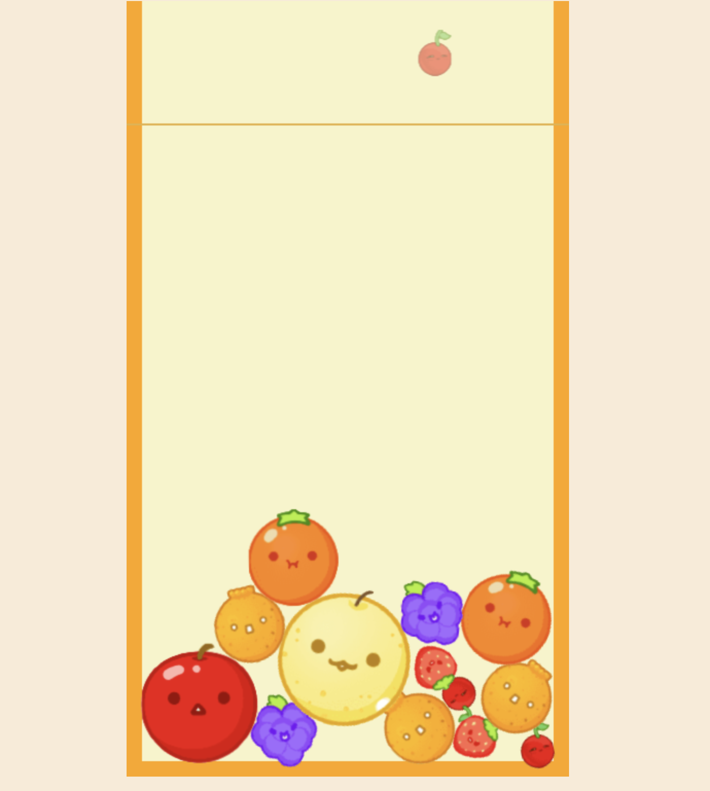

clone coding the Suika game.

I used [matter.js](https://github.com/liabru/matter-js) for this project, and I completed the cloning of the Suika Game. It is the first version, so the necessary function was built and not very stable, but still, it was a fun activity, and in future versions, I will upgrade to more stable gravity with advanced matter.js knowledge. Let's try to make a watermelon!

### screenshot ###

## plan to do ##
draw fruits images and render sprite texture later.
